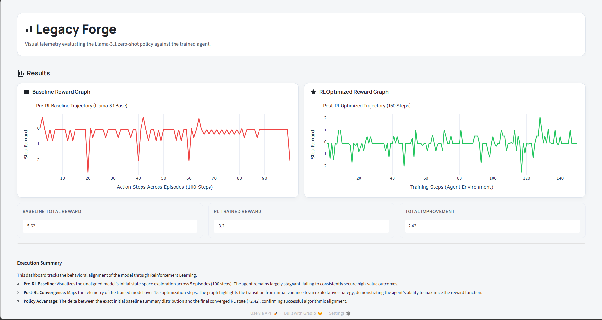

# Gradio RL Model Comparison Demo



This dashboard tracks the behavioral alignment of a model through Reinforcement Learning, comparing a pre-RL baseline zero-shot policy against a post-RL optimized agent.

## File structure

- `app.py` - Main Gradio application
- `requirements.txt` - Python dependencies (requires `gradio`, `plotly`, and `numpy`)
- `image.png` - Dashboard screenshot

## Run on Windows (PowerShell)

1. Create virtual environment:

   ```powershell
   py -m venv .venv
   ```

2. Activate virtual environment:

   ```powershell
   .\.venv\Scripts\Activate.ps1
   ```

3. Install dependencies:

   ```powershell
   pip install -r requirements.txt
   ```

4. Run app:

   ```powershell
   python app.py
   ```

5. Open URL shown in terminal (usually http://127.0.0.1:7860).